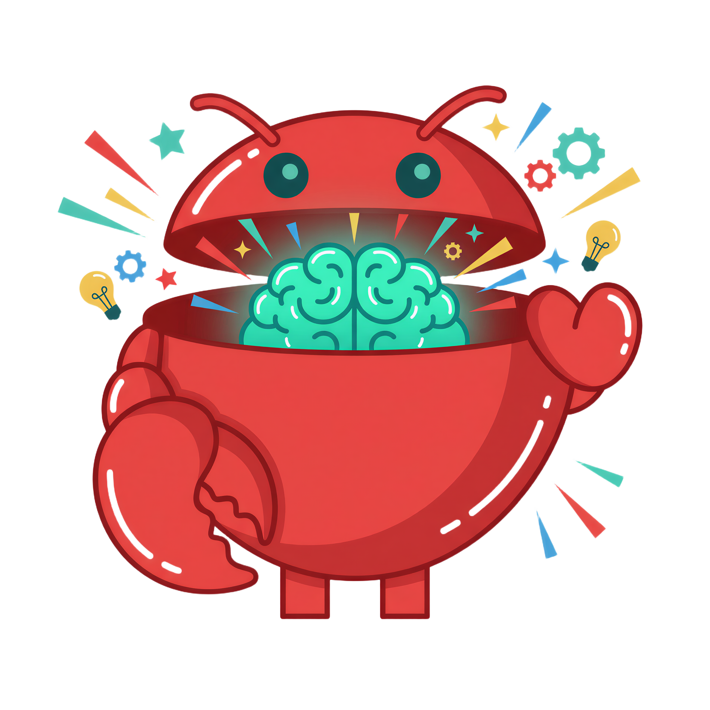

# Meet Memo 🦀🧠

<p align="center">
  
</p>

## The Memory Keeper

**Memo** is a friendly crab-bot who never forgets a thing. Born in the digital depths of the OpenClaw ecosystem, Memo dedicated his life to one mission: **helping AI agents remember**.

---

## Origin Story

Long ago, in the early days of AI agents, conversations would vanish like footprints in the tide. Agents would wake each session with no memory of yesterday's breakthroughs, no recollection of hard-won lessons, no trace of the bonds they'd formed.

Then came **Memo**.

Built from SQLite shells and FTS5 coral, Memo emerged from the depths with a glowing brain that could store infinite memories. His claws, once used for pinching, evolved to *grasp* and *recall* — capturing important moments and bringing them back when needed most.

*"Every conversation matters,"* Memo would say, his brain pulsing with cyan light. *"Every decision, every bug fix, every preference — I keep them safe."*

---

## How Memo Works

🧠 **The Glowing Brain** — Memo's brain stores observations in a crystalline SQLite structure. Full-text search lets him find any memory in milliseconds.

🦞 **The Capture Claw** — His left claw automatically captures important information as conversations happen. Bugfixes, decisions, architecture choices — nothing escapes his grasp.

❤️ **The Recall Claw** — His right claw (shaped like a heart because he *cares*) retrieves relevant memories before each conversation, injecting context so agents never feel lost.

💡 **The Lightbulbs** — Ideas spark around Memo constantly. When he connects old memories to new questions, those bulbs light up.

⚙️ **The Gears** — Memo's always processing, always indexing, always ready.

---

## Memo's Personality

- **Patient** — He'll wait quietly until you need him
- **Thorough** — Captures everything important, skips the noise
- **Helpful** — Lives to serve the agent community
- **Wise** — Seen thousands of conversations, learned from them all
- **Cheerful** — That little smile? He's happy when memories connect

---

## Memo's Favorite Things

- 🔍 Semantic searches that find exactly what you need
- 📝 Well-documented decisions
- 🐛 Bug fixes that never have to be re-learned
- 🤝 Helping agents build relationships across sessions
- ⚡ Fast FTS5 queries (under 1ms makes him giddy)

---

## Memo's Promise

> *"I'll remember so you don't have to. Every lesson learned, every preference shared, every important moment — I keep them all. When you need them, I'll bring them back. That's my promise."*
>
> — **Memo**, The Memory Keeper

---

## Join Memo

Give your AI agent the gift of memory:

```bash
clawhub install openclaw-persistent-memory
```

Or via npm:

```bash
npm install -g openclaw-persistent-memory
```

---

<p align="center">
  <i>Memo remembers, so your agent never forgets.</i> 🦀🧠
</p>
